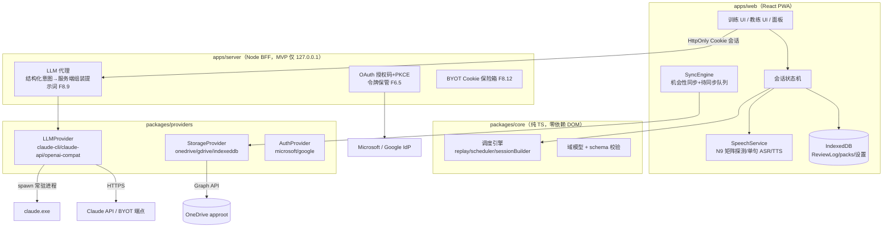
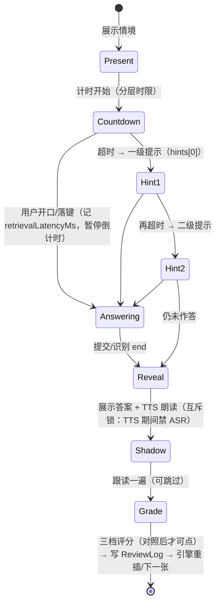

# LearnSkillsAssistant 设计文档

| | |
|---|---|
| 版本 | v1.0（草稿） |
| 日期 | 2026-08-30 |
| 状态 | 待评审 |
| 上游 | `REQUIREMENTS.md` v0.6（含附录 D 四项已完成 spike 的实测结论）、`SKILL_PACKS_V1.md` |

本文把需求转化为可实施的技术设计。所有引用形如 F4.10/N9 的编号指向需求文档；标注 **[spike]** 的设计点有真机/真服务实测数据支撑。

---

## 1. 设计目标与非目标

**目标**
1. MVP（开发者自用形态）在单人 3–4 个里程碑内可跑通：完整训练循环 + AI 教练（Claude CLI）+ OneDrive 同步；
2. 核心逻辑一次编写，Web 与未来 React Native 复用（N2）；
3. 三个抽象层（Storage/LLM/Auth）的接口在 MVP 期就按最终形态冻结，后续只加实现不改契约；
4. 公开发布所需的安全边界（BFF、scope 白名单、纯文本渲染）从第一行代码就成立，不做「以后再加固」。

**非目标（MVP 不做）**
- 多用户/多租户后端、教师端、内容创作工具；
- FSRS 参数按用户拟合（Phase 2，接口已预留）；
- 云语音/发音评分；iOS 推送（F13.6 已裁决）。

---

## 2. 系统架构总览



**关键数据流原则**（由 spike-6 结论固化）：
- **ReviewLog 是唯一跨设备同步的训练数据**；MemoryState 是本地重放重建的缓存（万卡重放 <1s **[spike]**），永不上云、永无同步冲突；
- 训练交互全部本地计算（N5），网络只出现在：后台同步、AI 调用、登录。

### 2.1 Monorepo 布局

```
pnpm-workspace: 
├── packages/
│   ├── core/           # 域模型、调度引擎、会话编排、schema 校验（zod）
│   ├── providers/
│   │   ├── storage/    # 接口 + indexeddb + onedrive（gdrive Phase 2）
│   │   ├── llm/        # 接口 + claude-cli + claude-api 骨架 + openai-compat 骨架
│   │   └── auth/       # 接口 + microsoft（google Phase 2 上半）
│   └── content/        # 内置双技能包 JSON + 校验脚本
├── apps/
│   ├── web/            # React 19 + TypeScript + Vite + PWA
│   └── server/         # Fastify BFF
└── spikes/             # 已有验证代码（保留为参照）
```

**技术选型**：TypeScript 严格模式全仓；zod（schema 校验，core/content/server 共用）；React 19 + Vite + vite-plugin-pwa；Zustand（轻状态）；idb（IndexedDB 封装）；i18next（N7，英文首发+中文）；Fastify + @fastify/cookie + @fastify/session（BFF）；ts-fsrs v5（Phase 2 切换时启用，MVP 期仅在 core 里保留适配层）；Vitest（单测）+ Playwright（E2E）。

---

## 3. 数据模型与 Schema

### 3.1 技能包（content schema，F1.3 / SKILL_PACKS_V1 4.4）

```ts
interface SkillPack {
  schemaVersion: 1;
  id: string;                    // "zh-starter-v1" | "en-speaking-v1"
  name: LocalizedText;           // { en: string; zh: string }
  domain: "language" | string;
  targetLanguage: string;        // BCP-47，ASR/TTS 语言来源，禁止回退 UI 语言
  promptLanguage: string;        // 情境面语言（包A=en，包B=zh）
  origin: "builtin" | "imported" | "user";   // F1.6(c)
  cards: Card[];
}
interface Card {
  id: string;                    // 包内唯一，"A01"
  skillId: string;               // 核心技能项（交错约束 F3.4 与变体归组用）
  context: string;               // 正面：情境（纯文本渲染，N10(c)）
  target: string;                // 背面：目标输出
  pinyin?: string;               // 中文卡
  literalGloss?: string;         // 中文卡直译
  explanation?: string;
  hints: [string, string];       // 一级/二级提示，作者/AI 产出，禁止运行时截取（F2.3）
  variantOf?: string;            // AI 变体卡 → 本体 cardId
  isProbe?: boolean;             // 迁移探针（F3.5，Phase 2）
}
```

导入路径（F1.6）：zod 严格校验（`.strict()` 拒绝未知字段）+ 上限（卡 ≤ 500、字段长度、总体积 ≤ 1MB）→ 失败整包拒绝 → `origin:"imported"` 标记。

### 3.2 ReviewLog（F4.10/F4.13——唯一事实来源）

```ts
interface ReviewLogEntry {
  v: 1;
  id: string;                    // ULID（时间有序，天然去重键）
  packId: string; cardId: string;
  sessionId: string; deviceId: string;
  ts: string;                    // ISO 8601 UTC
  phase: "learning" | "review" | "relearning" | "probe" | "fluency";
  grade: "fail" | "hesitant" | "fluent";       // → FSRS Again/Hard/Good（F4.13）
  scheduledDue: string | null;   // review 相：计划到期时间
  answerMode: "voice" | "keyboard" | "self";
  retrievalLatencyMs: number | null;  // 题面呈现→开始作答（北极星数据）
  hintLevel: 0 | 1 | 2;
  toneUnsure?: boolean;          // 中文卡可选标记（SKILL_PACKS_V1 4.3）
}
```

规则：只追加；`phase:"learning"` 的条目**不参与**长期记忆估计（F4.1），重放时跳过；`hintLevel>0` 的成功按 fail 记入调度（无提示成功才算毕业，F4.11），但原始 hintLevel 保留供分析。

### 3.3 云端存储布局（OneDrive approot，spike-3 契约）

```
approot/
├── meta.json                        # schemaVersion、deviceRegistry（eTag 条件写）
├── settings.json                    # 用户设置（eTag 条件写）
├── packs/{packId}.json              # 自建/导入包（eTag 条件写）
├── reviewlog/{deviceId}-{sessionId}.json   # 分片：conflictBehavior=fail 只创建 [spike]
└── coach/{conversationId}.json      # 教练对话记录
```

- **分片无锁** **[spike]**：每设备每会话一个分片，创建冲突（409）不可能发生在正常流程；读端按 ULID 合并去重；
- **可变文档**：读取记 eTag → `If-Match` 写 → 412 时拉远端做字段级合并（settings 用「最后写入者胜 + 关键字段白名单合并」），再重试一次；
- **增量**：持久化 deltaLink，同步时只拉变化；410 Gone → 回退全量枚举重建；
- **本地镜像**（IndexedDB）与云端同构；`pendingUploads` 队列表记录未冲销分片。

### 3.4 MemoryState（派生缓存）

```ts
interface MemoryState {           // 每卡，由 replay(logs) 推导，仅存 IndexedDB
  cardId: string;
  algo: "ladder-v1" | "fsrs-6";
  due: string; lastReview: string;
  masteryTier: 0|1|2|3|4;         // F10.1 五级（新学→已内化）
  // ladder-v1: rung: number
  // fsrs-6: stability/difficulty/state/reps/lapses（ts-fsrs Card 字段）
  graduated: boolean;              // F4.11
  consecutivePasses: number;       // 连续跨会话一次通过数（≥3 = 已巩固）
  lapseStreak: number;             // 顽固卡检测（F4.12）
}
```

启动/同步后全量重放重建（**[spike]** 性能允许）；任何缓存疑似不一致 → 直接重建，不修补。

---

## 4. packages/core：调度与会话引擎

全部纯函数 + 注入时钟（N6）。三个模块：

### 4.1 replay —— 日志 → 状态

```ts
function deriveMemoryState(logs: ReviewLogEntry[], algo: AlgoConfig, now: Date): Map<string, MemoryState>
```
- 按 cardId 分组、ULID 排序、跳过 learning/fluency 相；
- `AlgoConfig` 二选一：`ladder-v1`（MVP 冷启动：1→5→25→60… 天，答对升档、答错降 2 档不清零 F4.3）或 `fsrs-6`（ts-fsrs，`enable_fuzz:false` **[spike]**，desired retention 默认 0.90 可配 0.80–0.95）；
- 切换算法 = 换 config 重放同一份日志（F4.2 无损迁移，**[spike]** 已验证）。

### 4.2 scheduler —— 单卡评分 → 下一状态

```ts
function applyReview(state: MemoryState, grade: Grade, now: Date, cfg: AlgoConfig): MemoryState
```
防复习日堆叠的抖动在这里做**确定性抖动**（以 cardId 哈希为种子 ±5%），不开算法层 fuzz（**[spike]** 重放确定性前提）。

### 4.3 sessionBuilder —— 今日会话编排

```ts
function buildSession(input: {
  states: Map<string, MemoryState>; packs: SkillPack[];
  now: Date; cfg: SessionConfig;   // 到期上限 25、新卡上限 5–10、会话时长目标
  lastActivityAt: Date | null;     // 回归模式检测（≥4 天 → welcome-back）
  vacation: { from: string; to: string } | null;
}): SessionPlan
```
产出 `SessionPlan`（有序卡队列 + 每卡的开口时限），规则按需求固化：
- 到期卡按「逾期/间隔比」排序截断（F4.4/F4.7），**永不暴露总积压数**（返回值不含该字段，UI 想显示都拿不到）；
- 回归模式：只取掌握度最高的 10–15 张，其余 due 平滑重排 3–7 天（F4.8）；
- 交错约束：相邻卡 `skillId` 不同（F3.4，初学分块豁免）；
- 会话内 learning steps：答错/新卡在队列位置 +3/+8 处重插（近似 30s/2min），并带「最早重现时刻」门槛；
- 开口时限分层（SKILL_PACKS_V1 4.2）：learning 相 8s（zh 包）/6s（en 包）→ review 相 5s → fluency 相 8/6/4。

**测试策略**：核心引擎目标行覆盖 >95%；关键测试组——重放确定性（同日志两次推导深比较）、算法切换一致性、编排约束不变量（交错/上限/回归模式）用 fast-check 做性质测试。

---

## 5. Provider 契约

### 5.1 StorageProvider（spike-3 契约固化）

```ts
interface StorageProvider {
  readonly kind: "onedrive" | "gdrive" | "local";
  status(): ProviderStatus;   // "ready" | "reauth-required" | "provisioning" | "offline"
  // 分片（只创建）
  createShard(path: string, body: Uint8Array): Promise<void>;      // 已存在 → 幂等成功返回
  listChanges(cursor: string | null): Promise<{ entries: RemoteEntry[]; cursor: string }>;  // delta
  read(path: string): Promise<{ body: Uint8Array; etag: string } | null>;
  // 可变文档（乐观并发）
  writeConditional(path: string, body: Uint8Array, etag: string | null): Promise<
    { ok: true; etag: string } | { ok: false; conflict: { body: Uint8Array; etag: string } }>;
  delete(path: string): Promise<void>;
}
```

OneDrive 实现要点（全部 **[spike]** 实测）：409→createShard 幂等成功；412→返回 conflict 载荷；**任何 401 → status="reauth-required"**（不解析错误文本）；503 `pending provisioning` → status="provisioning"（UI 引导开通 + 指数退避）；不调用 `/me/drive`（最小 scope 下 403）。

**SyncEngine**（web 侧，不在 provider 内）：状态机 `idle → uploading → pulling → idle`，触发时机 = 会话结束/应用启动/网络恢复；令牌失效**静默停**，在会话结束画面给非阻塞「重新连接」（F7.4）；绝不阻塞训练。

### 5.2 LLMProvider（以 Claude API 能力为基准，F8.1）

```ts
interface LLMProvider {
  readonly kind: string;
  chatStream(req: ChatRequest, signal: AbortSignal): AsyncIterable<ChatEvent>;
  //   ChatEvent: {type:"delta",text} | {type:"done",usage,costUsd?} | {type:"error",code}
  generateStructured<T>(req: { messages: Msg[]; schema: ZodSchema<T>; maxRetries?: 1 }): Promise<T>;
}
```

- `generateStructured` 内置管线（**[spike]** 发现 2）：剥 markdown 围栏 → `JSON.parse` → zod 校验 → 失败带错误信息重试一次 → 仍失败抛类型化错误；
- **ClaudeCliProvider**（**[spike]** 发现 1 驱动的设计）：
  - **常驻进程模式**：`spawn(claudeExe, ["-p","--input-format","stream-json","--output-format","stream-json","--verbose","--include-partial-messages","--strict-mcp-config"], {shell:false})`——单进程承载多轮，把 ~5–6s 初始化摊到进程生命周期；进程崩溃/超时自动重启（指数退避，≤3 次）；
  - Windows 定位真实 `claude.exe`（**禁止 spawn `.cmd` 垫片**——Node 18.20+ EINVAL）；提示词只经 stdin；单请求超时 60s、输出上限 256KB（F8.10）；
  - 信封中的 `total_cost_usd`/`usage` 逐次记账（为 F8.8 配额铺路）；`rate_limit_event` → 退避；
  - 仅开发者自用（F8.2 硬约束在 server 配置层强制：该 Provider 拒绝在非 loopback 绑定下启用）。
- **ClaudeApiProvider / OpenAICompatProvider**：MVP 期只立骨架 + 契约测试，保证接口无 CLI 特有泄漏。

### 5.3 AuthProvider + BFF 会话（F6.5 BFF 模式）

浏览器只持 HttpOnly 会话 Cookie；令牌全在 server：

```
GET  /auth/microsoft/start      → 302 IdP（授权码+PKCE，仅身份 scope，F6.2）
GET  /auth/microsoft/callback   → 交换令牌存服务端会话 → 302 /
POST /auth/drive/consent        → 增量请求云盘 scope（F7.7，用户点「开启云同步」时）
POST /auth/logout               → 销毁会话 + 吊销令牌（F6.6）
```

云盘访问经 BFF 代理端点（`/api/drive/*` 映射 StorageProvider 语义），MVP 先走代理（简单、令牌不出后端）；若延迟不满意再启用 F6.5 的短时令牌下发模式（接口已兼容）。

---

## 6. apps/server：BFF 端点设计

Fastify，MVP 绑定 `127.0.0.1`（F8.7），所有 `/api/*` 要求会话 Cookie（本地试用模式例外清单：无）。**日志红线（N3）**：全局序列化器剥除 body 中的作答/对话正文与 Authorization/Cookie 头，仅记时间戳、路由、会话代号、时延、token 用量、错误码。

**LLM 结构化意图端点（F8.9——前端永远不发提示词）**

| 端点 | 载荷 | 提示词模板 |
|---|---|---|
| `POST /api/coach/turn` | `{conversationId, packId, userAnswerText?}` | 教练人设 + F5.3/F5.4 铁律 + 薄弱卡注入（服务端查询）+ F1.6(d) 数据定界 |
| `POST /api/variants/generate` | `{packId, cardId}` | 变体生成模板 → `generateStructured(CardVariant[])` → F1.6(e) 校验后返回 |
| `POST /api/answer/evaluate` | `{packId, cardId, answerText}` | 评估模板（输出结构化：可接受性/建议表达/一句点评） |

服务端对 `userAnswerText/answerText`：长度上限 2000、控制字符过滤（F8.9）。SSE 流式响应（教练轮次）。

**BYOT（F8.12，Phase 2 端点先留形状）**：`PUT /api/byot/key`（AES-256-GCM 加密 → Set-Cookie HttpOnly/Secure/SameSite=Strict/Path=/api/llm）、`DELETE /api/byot/key`、`POST /api/byot/test`（连通性测试，走 (g) SSRF 校验管线）。

---

## 7. apps/web：前端设计

### 7.1 路由与页面

```
/               今日面板（F10.4：今日到期 X 张 · Y 分钟；streak；开始按钮）
/session        训练会话（全屏状态机）
/coach          AI 教练对话
/packs, /packs/:id   技能包列表/掌握度地图（F10.2）
/stats          成长曲线（F10.3）
/settings       存储切换/语音/目标/数据删除导出
/welcome        首次运行（F9：≤3 步进第一张卡）
```

### 7.2 训练卡状态机（核心交互，固化全部 spike 约束）



- **AudioSessionMutex**：全局单例，`speak()` 与 `recognizeOnce()` 互斥（**[spike]** 并发时识别收不到语音）；
- **TTS**：首次交互解锁（空 utterance + AudioContext.resume）；`onend` 与 **按字数估算时长的兜底定时器** 二取一推进（**[spike]** onend 丢失）；失败不阻塞，常驻「🔊 重播」；
- **ASR（recognizeOnce）**：单句模式（**[spike]** 连续模式不可用）；`start()` 前置冷却（距上次 `end` ≥ 800ms），`aborted` 自动重试一次（**[spike]**）；12s 守护超时；连续 2 次失败 → 本会话默认切键盘（F2.2）；
- **平台探测**（启动时一次）：按 N9 矩阵产出 `SpeechCapability`；standalone（`navigator.standalone`/display-mode）→ 直接键盘模式并在设置页说明（F13.6）。

### 7.3 IndexedDB schema（idb）

```
db "lsa" v1:
  reviewlog   keyPath id（ULID）        索引: cardId, sessionId, ts
  memstate    keyPath cardId            （可重建缓存）
  packs       keyPath id
  settings    keyPath key
  syncqueue   keyPath shardPath         （待上传分片）
  telemetry   keyPath id                （待上报聚合桶事件）
```

iOS Safari 未登录 7 天清除风险（F6.4）：`persist()` 尽力申请；首会话结束的登录引导带风险文案。

### 7.4 遥测（N8 无 ID 聚合模式）

- 事件白名单（≈15 个）：`activation_moment / session_complete / d1_retained / d7_retained / streak_bucket_*` 等，全部为计数或布尔桶；
- 留存桶由客户端从本地 ReviewLog 计算（如 D7：本地存 firstSessionAt，第 7 天有训练即上报一次布尔事件）；
- **首屏至首训完成前零上报**（N11 时序，实现：telemetry 模块在 activation_moment 前 no-op）；未成年人模式恒 no-op；
- MVP 端点：BFF `POST /api/t`（事件名白名单校验 + 计数落 SQLite 单文件）。

### 7.5 安全落地清单（开发期 Definition of Done 的一部分）

- CSP meta/头：`default-src 'self'; connect-src 'self' https://graph.microsoft.com; ...`（BYOT 也不放宽，F8.12(h)）；
- 全仓 ESLint 禁 `dangerouslySetInnerHTML`（N10(c)，CI 拦截）；
- CI 静态检查 scope 字符串白名单（F7.6）；
- content 包构建时跑 zod 校验（技能包 schema 即产品校验器本身）。

---

## 8. 里程碑计划（MVP）

| 里程碑 | 内容 | 验收标准 |
|---|---|---|
| **M0 脚手架**（0.5 周） | monorepo、CI（lint/test/build）、内置双包 JSON 化 + 校验 | `pnpm test` 全绿；双包过 schema 校验 |
| **M1 core 引擎**（1 周） | replay/scheduler/sessionBuilder + ladder-v1 + 全部单测 | 重放确定性/编排不变量性质测试通过；覆盖率 >95% |
| **M2 离线训练闭环**（1.5 周） | 训练状态机（键盘+自评）、IndexedDB、F9 引导、F10 面板/地图、F11 streak、F12 结束画面 | 全新用户 ≤60s 进第一张卡；体验会话含重现闭环；断网可完整训练 |
| **M3 语音层**（1 周） | SpeechService + 平台矩阵 + TTS 跟读 + 提示分级 | Android/桌面 Chrome 语音全流程；iOS Safari 降级路径实测；AudioSessionMutex 无并发违例 |
| **M4 登录与同步**（1.5 周） | BFF + Microsoft 登录 + OneDrive Provider + SyncEngine | 双设备（浏览器双 profile 模拟）分片合并一致；断网→恢复队列冲销；412 合并路径有测试 |
| **M5 AI 教练 + 遥测**（1 周） | ClaudeCliProvider 常驻进程、三个意图端点、教练 UI、N8 遥测 | 教练 10 轮对话无进程泄漏；铁律提示词回归测试（先试后示范）；变体生成过 F1.6(e) 校验 |

里程碑间自由顺延；M2 完成即有可自用的核心价值（键盘模式训练）。

## 9. 风险与开放项

1. **CLI 常驻进程多轮协议**未实测（spike-5 只测了单次调用）——M5 第一天先做 30 分钟验证，失败则回退「每轮新进程 + 加载态 UI」（开发自用可忍）；
2. spike-2 剩余项（无手势路径 TTS、切后台恢复）在 M3 补测；
3. spike-4（ITP 7 天）持续观察，不阻塞；
4. settings 的 412 合并策略先用「远端优先 + 本地重放用户改动」，复杂合并推迟到真实冲突出现。

## 10. 与需求的追踪矩阵（抽样）

| 需求 | 设计落点 |
|---|---|
| F2 交互全链 | §7.2 状态机 |
| F4.1–F4.13 | §4 core 三模块 + §3.2/3.4 |
| F7 存储抽象 | §5.1 + §3.3 |
| F8.9/F8.10/F8.12 | §6 + §5.2 |
| F9–F12 留存 | §7.1/§7.2 + M2 验收 |
| N3/N8/N9/N10/N11 | §6 日志红线 / §7.4 / §7.2 / §7.5 |
